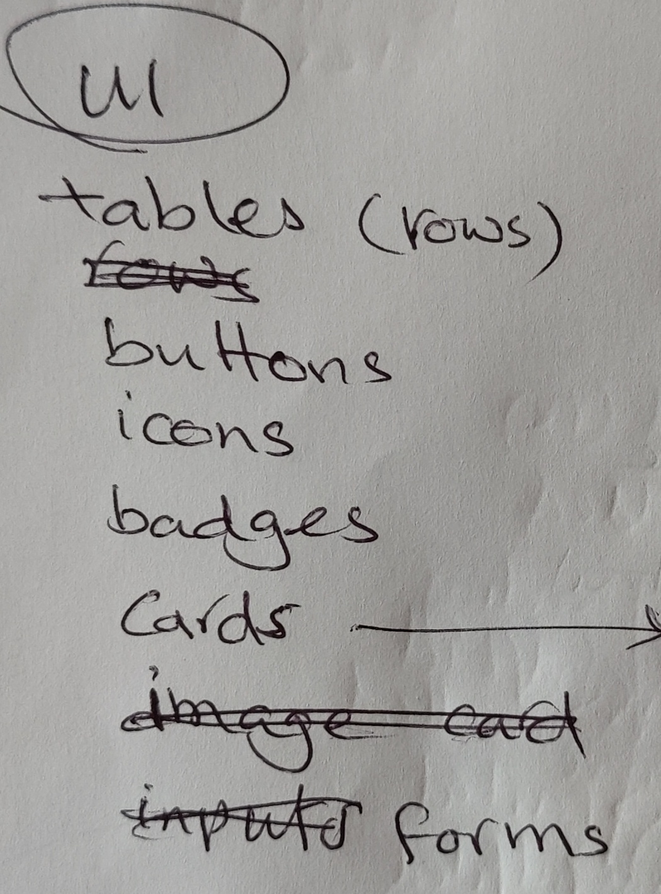

This is a [Next.js](https://nextjs.org) project bootstrapped with
[create-next-app](https://nextjs.org/docs/app/api-reference/cli/create-next-app).

## Getting Started

1. Clone the repository:

```
https://github.com/BruceRoyce/xapien
```

2. Run the development server:

```bash
npm install
npm run dev
```

3. Open [http://localhost:3000](http://localhost:3000) with your browser to see the result.

---

# Architecture

Based on the task, I envisioned the following relational data model:

## Tables

### Accounts

Accounts (also known as clients) appear to be the most crucial part of the business.

I conceptualized it as shown in the diagram below (please excuse my rushed sketches):


Please note that the **dates** fragment is a recurring element in almost every table.

### Plans

These are Xapien's products for the accounts, enabling us to generate revenue and sustain
operations! 

### Users

Users are members of an account (client – _please note that I will use "accounts" and "clients"
interchangeably. Please excuse my oversight_).


A client admin is responsible for managing the account and its users.

### Payment_methods

Each account requires at least one payment method to purchase plans.


### Orders

When we assign a plan (or top-up) to a client's account, an order is placed.


### Subscription

Orders initiate an interval of payments (e.g., monthly). We record this in the subscription table,
which is the most critical part of the flow for allowing or disallowing a user to use our products.
When the end date is reached, the subscription either renews (if renewable) or expires (as in the
case of a trial). If a payment fails, we cancel the subscription.

Instead of a more expensive solution like a cron job, I decided to perform these expiry checks upon
a user (of an account) login. This way, the subscription is updated while the user logs in, making
it blazing fast! 

### Queries


Now that everything is set, users can spend their credits on queries. I considered a flat cost of 1
credit per query. I've partially implemented this (for a mock result, of course!) but haven't
finalized it for this test.

---

## API and Routing

The API and routing are structured as follows, with functions in `utils`, `db`, and `http` having
(hopefully) self-explanatory names:

```
└── 📁api
    └── 📁lib
        └── db.ts
        └── http.ts
        └── preformQuery.ts
        └── utils.ts
        └── xapError.ts
    └── 📁v1
        └── 📁accounts
            └── route.ts
        └── 📁auth
            └── route.ts
        └── 📁orders
            └── route.ts
        └── 📁plans
            └── route.ts
        └── 📁queries
            └── route.ts
        └── 📁users
            └── route.ts
```

---

## UX

// TODO To be completed.

---

## UI

Just a quick sketch for a mobile-first design.

### Design Thought-process

### Placement

I divided a screen into its most critical zones: hotzone, thumb zone, and applied a 1/3 grid (Da
Vinci's 1/3 grid).


### Theme

Then, I opted for a table format—very similar to the concept of native apps, with a touch of subtle
and classy playfulness. I drew inspiration from the animations on the website's landing page (the
one on the screen at the top) and the overall color theme.


### Components and Organization

Based on the UI sketch, I listed the following components that the app would require:



- **Set of cards**
  - Plans (our products deserve some care)
  - General
  - Error message
  - User cards (in table rows)
- **Tables**
  - Table head
  - Table footer
  - Table rows
- **Buttons**
  - Primary
  - Secondary
  - Ghost
  - Textual
  - Each with or without an icon
  - Each in various states
- **Badges/chips** (to wrap small pieces of useful information in an organized manner)
- **Forms and inputs**
- A set of "lego bricked" components to create commonly used UI elements.
- A set of wrappers to establish the UI structure.
- A top navigation bar.

I recalled Reece mentioning graceful error handling as a point to consider. I conceived a pleasant
way to display error messages that would also showcase my CSS capabilities. Therefore, I created a
full CSS-driven drawer (similar to native phone drawers) to display intrusive messages specifically
for this demo.

Here is my folder structure for organizing components:

```
└── 📁components
    └── 📁badges
        └── Chip.tsx
    └── 📁buttons
        └── Button.tsx
        └── IconButton.tsx
    └── 📁cards
        └── AccountSignboard.tsx
        └── FancyCard.tsx
        └── GeneralCard.tsx
        └── InfoCard.tsx
        └── PlanCard.tsx
        └── Signboard.tsx
    └── 📁drawers
        └── DrawerCloseMark.tsx
        └── DrawerHeader.tsx
        └── GeneralDrawer.tsx
    └── 📁forms
        └── DemoFailCheckbox.tsx
        └── Input.tsx
    └── 📁icons
        └── ArrowBackward.tsx
        └── ArrowForward.tsx
        └── ChevronForward.tsx
        └── Close.tsx
        └── defaults.ts
        └── Logout.tsx
    └── 📁structure
        └── Article.tsx
        └── Container.tsx
        └── Main.tsx
    └── 📁tables
        └── AccountRow.tsx
        └── AccountsTable.tsx
        └── DashboardRow.tsx
        └── PlansTable.tsx
        └── RowAction.tsx
        └── RowTable.tsx
        └── RowTitle.tsx
        └── UserRow.tsx
        └── UsersTable.tsx
    └── 📁ui
        └── DashboardTable.tsx
        └── Everyone.tsx
        └── LoginForm.tsx
        └── Navbar.tsx
        └── not_implemented.tsx
        └── oops.tsx
        └── TablesGrid.tsx
        └── TopupInput.tsx
```

### Cards


### Tables


---

## APIs

I initially started by mocking and emulating the APIs, but it was consuming roughly the same amount
of time (if not more) to create a somewhat realistic mock as it was to build the actual API. So, I
quickly developed a backend that runs within the same Next.js app.

---

## Database

Upon installation, the app will create and seed a Sqlite3 database for this demo purpose.

---

## CSS

I made a conscious decision to use pure CSS (as opposed to atomic CSS frameworks like Tailwind,
etc.) because CSS proficiency was one of the questions in Oli's questionnaire. I divided the CSS
into a set of files, each targeting a specific concern, to make them easier to locate and maintain.

```
└── 📁css
    └── buttons.css
    └── cards.css
    └── forms.css
    └── global.css
    └── main.css
    └── nav.css
    └── reset.css
    └── xap-animations.css
```

These will be consolidated into a single `global.css` file and applied with a single import at the
main layout level.

---

## State Manager

While barely needed, the task sheet didn't specify a particular state manager. Therefore, I took the
liberty of choosing Zustand. I created a few slices, each serving a specific concern: admin states,
authentication concerns, and UI control states. All other states remained within their narrowest
scope. In only a couple of places did I need to drill props up to two levels, which didn't strongly
warrant adding them to global states.

```
└── 📁store
    └── adminSlice.ts
    └── authSlice.ts
    └── uiSlice.ts
    └── useStore.ts
```

---

## Other

// TODO To be added..
