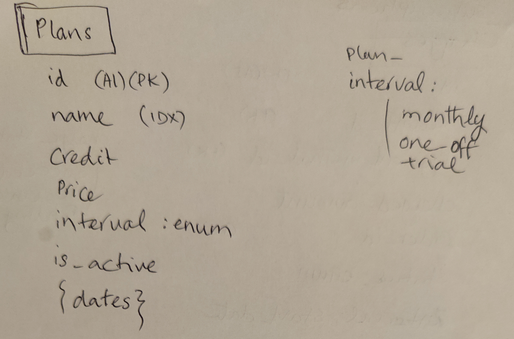
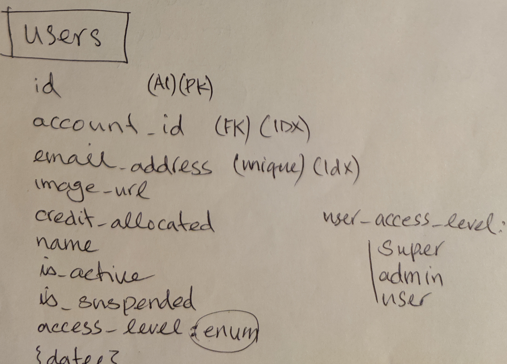
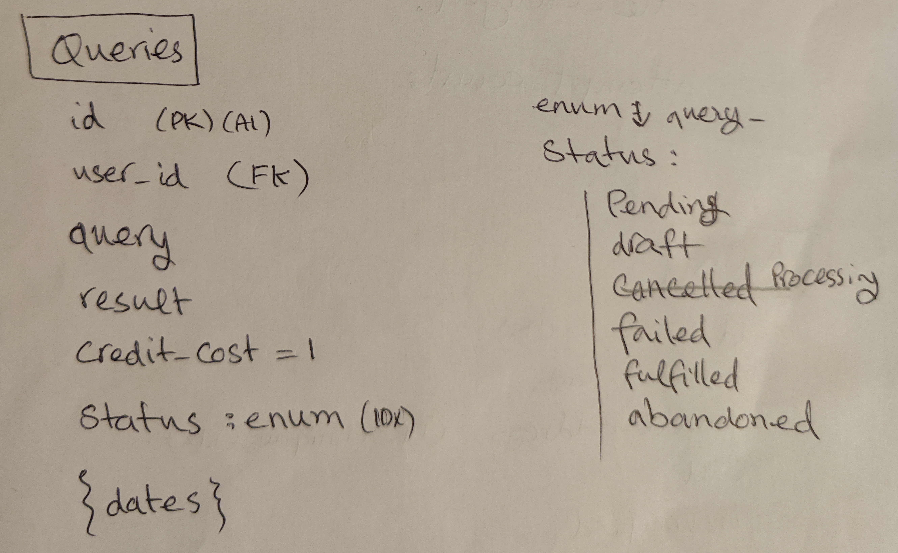
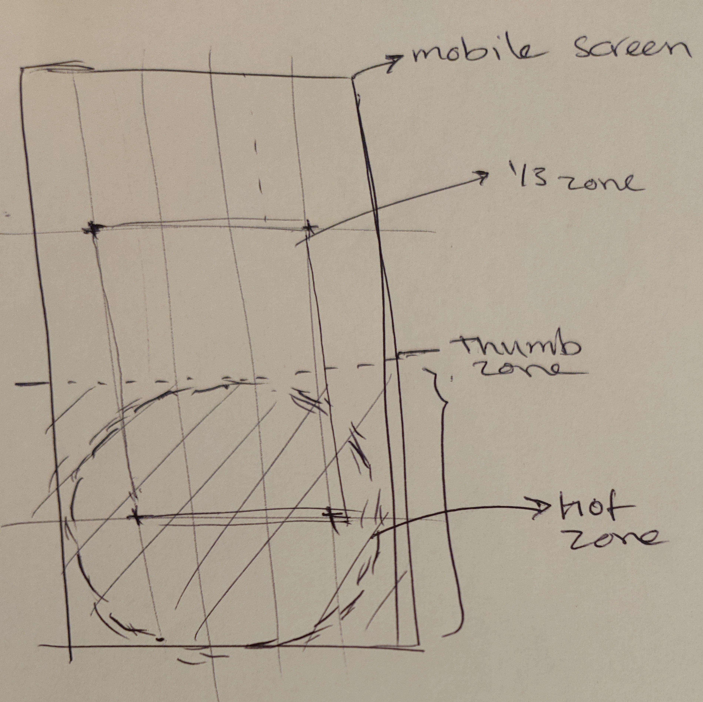
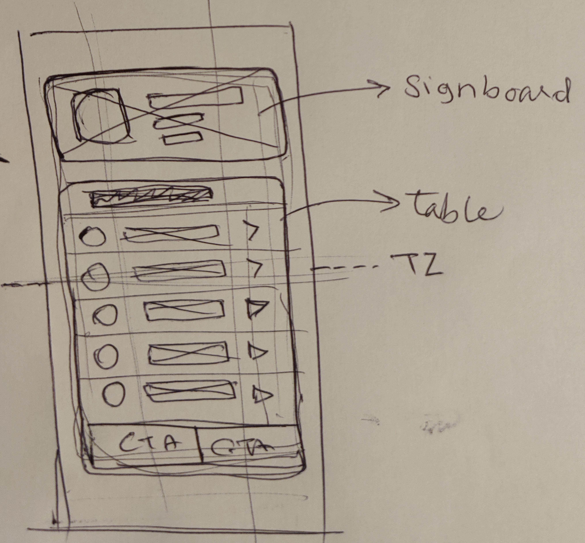

This is a [Next.js](https://nextjs.org) project bootstrapped with
[`create-next-app`](https://nextjs.org/docs/app/api-reference/cli/create-next-app).

## Getting Started

1st - clone the repo from

```
https://github.com/BruceRoyce/xapien
```

2nd - run the development server:

```bash
npm install
npm run dev
```

3rd - Open [http://localhost:3000](http://localhost:3000) with your browser to see the result.

# Architecture

Reading the task I imagined the following relational data model

## Tables

#### Accounts

Accounts (aka clients) seem to be the most important part of the business

I imagined it like the following diagram (please excuse my sketches - did them in rush)


Please note the **dates** fragment is a repeating fragment in (almost) every table.

#### Plans

Xapien products for the accounts! So we can pay taxes and maybe eat!


#### Users

Users are members of the account (client - _please note that I am going to use accounts and clients
interchangably._ Please excuse my ignorance)


A client admin is in charge of the account and its users

#### Payment_methods

To pay to purchase the plans, each account needs at least 1 method of payment


#### Orders

And so when we assign a plan (or topup) client's account, they/we place an order


#### Subscription

Orders initiate an interval of payments (eg monthly) so we keep the record of it in subscriptrion.
Subscription is the most important part of the flow to allow/disallow a user to use our products.
When end date reached the subscription either renews - if renewable, or expires (such as in the case
of trial). If payment fails we cancel the subscription.

Instead of something more expensive such as a cron job, I decided to preform these expirey checks
upon a user (of an account) login, so the subscription will be updated while we login the user. It's
blazing fast! 

#### Queries



Now that all is set, users can spend their credits in queries. I considered a flat cost of 1 credit
oer query. I partially implemented this (for a mock result of course!), but not finalised it fo
rthis test.

## UX

To be completed

## UI

Just a quick sketc for a mobile first design.

### Design Thought-process

#### Placement

So I divided a screen in its most critical zones. Namely, hotzone, thumb zone and applied a 1/3 grid
(Da Vinci's 1/3 grid)



#### Theme

Then I decided to go for a table format - very similar to the concept of native apps, with a bit of
subtle and classy playfulness. I got some inspirations from the animation on the websiotes landing
page. \*the one in the screen on the top) and the colour theme in general.


#### Cards


#### Tables


## APIs

I started with mocking / emulating the APIs but it was taking about the same amount of time (if not
more) to create an somewhat realistic mock than to actual realistic API. So I did a quick BE that
runs within the same Next.js app.

## Database

At the instalaltion the App will create a Sqlite3 database and seeds it for this demo purpose

## Other

To be added

This project uses
[`next/font`](https://nextjs.org/docs/app/building-your-application/optimizing/fonts) to
automatically optimize and load [Geist](https://vercel.com/font), a new font family for Vercel.
